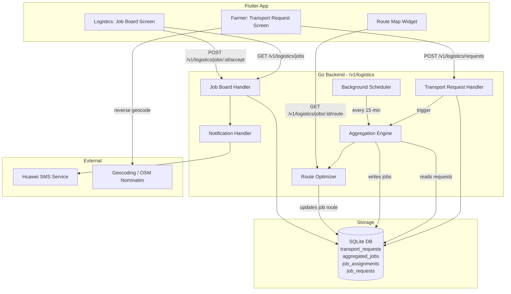
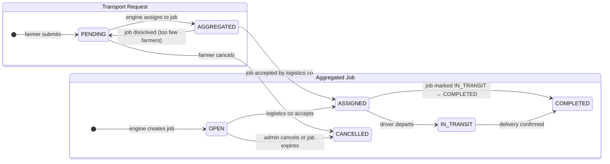
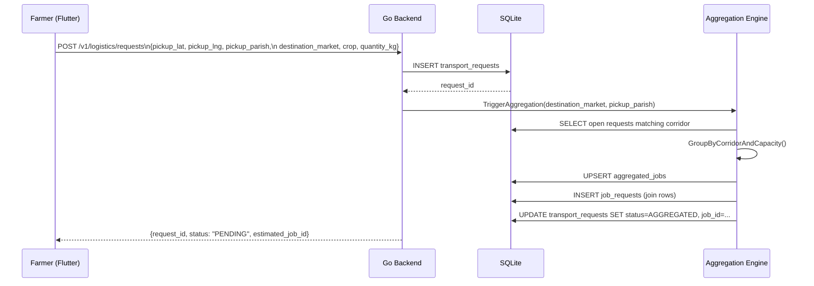
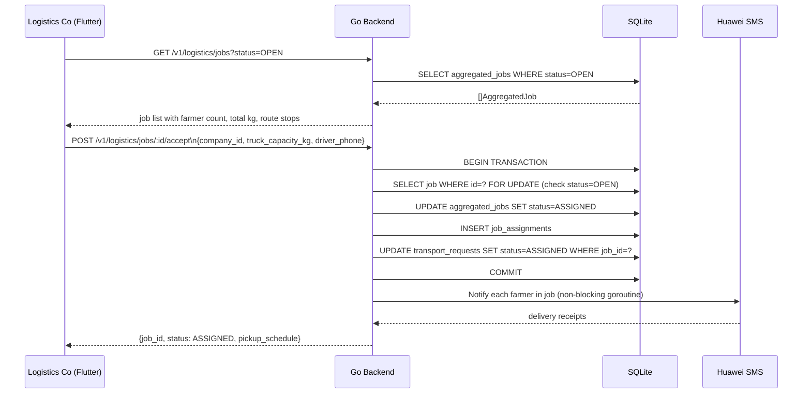
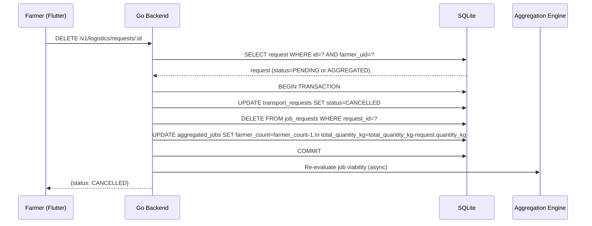
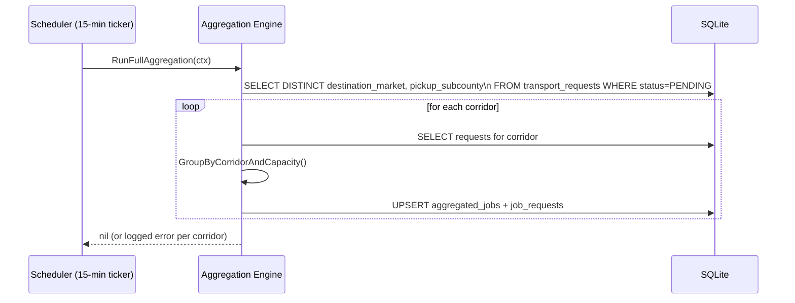

# Design Document: Logistics Aggregation Module

## Overview

The Logistics Aggregation Module enables smallholder farmers in Uganda to pool their transport demand so that a single truck can serve many farmers along a shared route — making truck hire economically viable for farmers who would otherwise sell locally at depressed prices (e.g., UGX 500/kg maize in Mubende vs UGX 1,200/kg in Kampala). The module collects farmer pickup locations and buyer destination locations, groups farmers by geographic proximity and route similarity, and presents aggregated transport jobs to logistics companies who can then accept and plan efficient multi-stop routes.

The feature integrates into the existing AgriChain Flutter app as a new feature module (`lib/features/logistics/`) following the established blockchain feature architecture, with a corresponding Go backend package (`internal/logistics/`) that exposes REST endpoints under `/v1/logistics/` via the existing Gin router. Data is persisted in the existing SQLite database via new migration tables.


---

## Architecture




---

## Status State Machine

The following diagram shows all valid status transitions for transport requests and aggregated jobs.



**Rules**:
- No backward transitions are permitted (e.g., `ASSIGNED → OPEN` is invalid).
- A job can only be cancelled from `OPEN` status; once `ASSIGNED` it must be completed or handled via admin intervention.
- When a job is cancelled, all its `AGGREGATED` requests revert to `PENDING` for re-aggregation.


---

## Sequence Diagrams

### Farmer Submits a Transport Request



### Logistics Company Views and Accepts a Job



### Farmer Cancels a Transport Request



**Note**: Cancellation is only permitted when the request is in `PENDING` or `AGGREGATED` status. Once the job is `ASSIGNED` (truck booked), cancellation requires admin intervention.

### Background Aggregation Sweep




---

## Components and Interfaces

### Component 1: Transport Request Handler (Go)

**Purpose**: Validates and persists a farmer's transport request, then triggers the aggregation engine.

**Interface**:
```go
// POST /v1/logistics/requests
type TransportRequestInput struct {
    PickupLat         float64 `json:"pickup_lat" binding:"required"`
    PickupLng         float64 `json:"pickup_lng" binding:"required"`
    PickupParish      string  `json:"pickup_parish" binding:"required"`
    PickupSubcounty   string  `json:"pickup_subcounty"`
    DestinationMarket string  `json:"destination_market" binding:"required"`
    CropType          string  `json:"crop_type" binding:"required"`
    QuantityKg        float64 `json:"quantity_kg" binding:"required,gt=0"`
    HarvestReadyAt    string  `json:"harvest_ready_at"` // RFC3339
    FarmerNotes       string  `json:"farmer_notes"`
}

type TransportRequestResponse struct {
    RequestID      string  `json:"request_id"`
    Status         string  `json:"status"`
    EstimatedJobID *string `json:"estimated_job_id"`
    CreatedAt      string  `json:"created_at"`
}

// GET /v1/logistics/requests/:id  (farmer views own request)
// DELETE /v1/logistics/requests/:id  (farmer cancels own request)
```

**Responsibilities**:
- Validate input (non-zero coordinates within Uganda bounding box, quantity > 0)
- Persist to `transport_requests` table with status `PENDING`
- Call `AggregationEngine.TriggerAggregation()` asynchronously (fire-and-forget goroutine)
- Return request ID and current aggregation status
- Allow farmer to retrieve their own request by ID
- Allow farmer to cancel a `PENDING` or `AGGREGATED` request (not `ASSIGNED`)

**Route registration** (follows existing `server.go` pattern):
```go
// In server.go, inside the farmer role group:
logistics := handlers.NewLogisticsHandler(db, engine, notifier)
logistics.RegisterV1Farmer(farmerGroup)   // POST/GET/DELETE /v1/logistics/requests
logistics.RegisterV1Logistics(logisticsGroup) // GET/POST /v1/logistics/jobs
logistics.RegisterV1ReadOnly(v1)          // GET /v1/logistics/jobs (public read)
```


### Component 2: Aggregation Engine (Go)

**Purpose**: Groups open transport requests into aggregated jobs by geographic corridor and truck capacity.

**Interface**:
```go
type AggregationEngine interface {
    TriggerAggregation(ctx context.Context, destinationMarket, pickupParish string) error
    RunFullAggregation(ctx context.Context) error
}

type aggregationEngine struct {
    db              *sqlite.DB
    routeOptimizer  RouteOptimizer
    maxRadiusKm     float64 // default 15 km grouping radius
    minFarmersToJob int     // default 3 farmers before creating a job
    truckCapacityKg float64 // default 10,000 kg (10 tons)
}
```

**Responsibilities**:
- Query all `PENDING` requests for a given corridor (destination + origin region)
- Apply geographic clustering (haversine distance ≤ `maxRadiusKm`)
- Group clusters into jobs that do not exceed `truckCapacityKg`
- Upsert `aggregated_jobs` records; link requests via `job_requests` join table
- Update linked `transport_requests` rows to `status=AGGREGATED, job_id=<job_id>`
- Invoke `RouteOptimizer` to compute the ordered stop sequence
- Re-evaluate job viability when a request is cancelled (dissolve job if below `minFarmersToJob`)

### Component 3: Route Optimizer (Go)

**Purpose**: Computes an efficient ordered sequence of pickup stops for a given job using a nearest-neighbour heuristic (suitable for Uganda's road network constraints).

**Interface**:
```go
type RouteOptimizer interface {
    OptimizeRoute(ctx context.Context, job AggregatedJob, requests []TransportRequest) (RouteResult, error)
}

type RouteResult struct {
    OrderedStops    []RouteStop `json:"ordered_stops"`
    TotalDistanceKm float64     `json:"total_distance_km"`
    EstimatedHours  float64     `json:"estimated_hours"`
}

type RouteStop struct {
    StopOrder  int     `json:"stop_order"`
    RequestID  string  `json:"request_id"`
    FarmerName string  `json:"farmer_name"`
    Parish     string  `json:"parish"`
    Lat        float64 `json:"lat"`
    Lng        float64 `json:"lng"`
    QuantityKg float64 `json:"quantity_kg"`
}
```

**Responsibilities**:
- Accept a list of pickup coordinates
- Apply nearest-neighbour TSP heuristic starting from the centroid of the cluster
- Return ordered stops with cumulative distance and estimated travel time
- Use average Uganda rural road speed of 40 km/h for time estimates


### Component 4: Job Board Handler (Go)

**Purpose**: Exposes aggregated jobs to logistics companies and handles job acceptance.

**Interface**:
```go
// GET /v1/logistics/jobs
type JobListQuery struct {
    Status            string  `form:"status"`   // OPEN | ASSIGNED | COMPLETED
    DestinationMarket string  `form:"market"`
    MinQuantityKg     float64 `form:"min_kg"`
}

// POST /v1/logistics/jobs/:id/accept
type JobAcceptInput struct {
    CompanyID       string  `json:"company_id" binding:"required"`
    TruckCapacityKg float64 `json:"truck_capacity_kg" binding:"required,gt=0"`
    DriverPhone     string  `json:"driver_phone" binding:"required"`
    PlannedPickupAt string  `json:"planned_pickup_at"` // RFC3339
}

// POST /v1/logistics/jobs/:id/complete  (driver marks delivery done)
type JobCompleteInput struct {
    CompanyID string `json:"company_id" binding:"required"`
    Notes     string `json:"notes"`
}
```

**Responsibilities**:
- List open jobs with farmer count, total kg, destination, and route summary
- Validate truck capacity ≥ job total kg before accepting
- Transition job status `OPEN → ASSIGNED` atomically (single DB transaction)
- Create `job_assignments` record
- Trigger SMS notifications to all farmers in the job (non-blocking goroutine)
- Allow driver to mark job `IN_TRANSIT` and `COMPLETED`
- Return `409 Conflict` if job was already accepted concurrently

### Component 5: Notification Handler (Go)

**Purpose**: Sends SMS notifications to farmers when their transport job is accepted or status changes.

**Interface**:
```go
type NotificationHandler interface {
    NotifyJobAccepted(ctx context.Context, job AggregatedJob, assignment JobAssignment, farmers []TransportRequest) error
    NotifyJobCompleted(ctx context.Context, job AggregatedJob, farmers []TransportRequest) error
}

type smsNotifier struct {
    smsClient HuaweiSMSClient // wraps existing Huawei SMS env vars
    logger    *log.Logger
}
```

**Responsibilities**:
- Compose SMS messages with farmer name, crop type, pickup date, and job reference ID
- Send via the existing Huawei SMS service (`HUAWEI_SMS_*` env vars)
- Log failed deliveries with farmer IDs for manual retry; do not block job acceptance
- Message template: `"AgriChain: Your {crop} transport (Job {job_id}) is confirmed. Pickup: {date}. Driver: {phone}."`

### Component 6: Background Scheduler (Go)

**Purpose**: Periodically runs `RunFullAggregation` to catch any requests missed by the per-request trigger (e.g., after a server restart or aggregation error).

**Interface**:
```go
type Scheduler struct {
    engine   AggregationEngine
    interval time.Duration // default 15 minutes
    logger   *log.Logger
}

func NewScheduler(engine AggregationEngine, interval time.Duration) *Scheduler
func (s *Scheduler) Start(ctx context.Context)  // launches background goroutine
func (s *Scheduler) Stop()                       // graceful shutdown
```

**Responsibilities**:
- Tick every `interval` (default 15 minutes)
- Call `engine.RunFullAggregation(ctx)` on each tick
- Log errors per corridor without crashing the scheduler
- Respect context cancellation for graceful server shutdown

### Component 7: Logistics Feature Module (Flutter)

**Purpose**: Provides the farmer-facing transport request form and the logistics-company-facing job board.

**Sub-components**:
- `LogisticsProvider` — ChangeNotifier managing request/job state
- `LogisticsApiService` — HTTP client wrapping `/v1/logistics/*` endpoints
- `TransportRequestScreen` — farmer form with map pin picker
- `JobBoardScreen` — logistics company view of open aggregated jobs
- `JobDetailScreen` — route map, stop list, accept button
- `LogisticsModels` — `TransportRequest`, `AggregatedJob`, `RouteResult` Dart models


---

## Data Models

### SQLite Schema (new migration tables)

```sql
-- Farmer transport requests
CREATE TABLE IF NOT EXISTS transport_requests (
    id               TEXT PRIMARY KEY,         -- "TR-<hex12>"
    farmer_uid       TEXT NOT NULL,
    farmer_name      TEXT NOT NULL,
    farmer_phone     TEXT,
    pickup_lat       REAL NOT NULL,
    pickup_lng       REAL NOT NULL,
    pickup_parish    TEXT NOT NULL,
    pickup_subcounty TEXT,
    destination_market TEXT NOT NULL,          -- e.g. "Kampala - St. Balikuddembe"
    crop_type        TEXT NOT NULL,
    quantity_kg      REAL NOT NULL CHECK(quantity_kg > 0),
    harvest_ready_at TEXT,                     -- RFC3339
    farmer_notes     TEXT,
    status           TEXT NOT NULL DEFAULT 'PENDING',
                                               -- PENDING | AGGREGATED | ASSIGNED | COMPLETED | CANCELLED
    job_id           TEXT,                     -- FK → aggregated_jobs.id (nullable)
    created_at       TEXT NOT NULL,
    updated_at       TEXT NOT NULL,
    FOREIGN KEY(farmer_uid) REFERENCES users(uid) ON DELETE CASCADE,
    FOREIGN KEY(job_id) REFERENCES aggregated_jobs(id) ON DELETE SET NULL
);

-- Aggregated transport jobs
CREATE TABLE IF NOT EXISTS aggregated_jobs (
    id                 TEXT PRIMARY KEY,       -- "JOB-<hex12>"
    destination_market TEXT NOT NULL,
    origin_region      TEXT NOT NULL,          -- e.g. "Mubende"
    total_quantity_kg  REAL NOT NULL,
    farmer_count       INTEGER NOT NULL,
    status             TEXT NOT NULL DEFAULT 'OPEN',
                                               -- OPEN | ASSIGNED | IN_TRANSIT | COMPLETED | CANCELLED
    route_json         TEXT,                   -- JSON: RouteResult
    centroid_lat       REAL,
    centroid_lng       REAL,
    created_at         TEXT NOT NULL,
    updated_at         TEXT NOT NULL
);

-- Join table: which requests belong to which job
-- Allows efficient lookup in both directions and supports cancellation cleanup
CREATE TABLE IF NOT EXISTS job_requests (
    job_id     TEXT NOT NULL,
    request_id TEXT NOT NULL,
    added_at   TEXT NOT NULL,
    PRIMARY KEY (job_id, request_id),
    FOREIGN KEY(job_id) REFERENCES aggregated_jobs(id) ON DELETE CASCADE,
    FOREIGN KEY(request_id) REFERENCES transport_requests(id) ON DELETE CASCADE
);

-- Job acceptance by logistics companies
CREATE TABLE IF NOT EXISTS job_assignments (
    id               TEXT PRIMARY KEY,         -- "ASN-<hex12>"
    job_id           TEXT NOT NULL,
    company_id       TEXT NOT NULL,
    driver_phone     TEXT NOT NULL,
    truck_capacity_kg REAL NOT NULL,
    planned_pickup_at TEXT,
    accepted_at      TEXT NOT NULL,
    status           TEXT NOT NULL DEFAULT 'ACTIVE',
    FOREIGN KEY(job_id) REFERENCES aggregated_jobs(id)
);

-- Indexes
CREATE INDEX IF NOT EXISTS idx_transport_requests_status      ON transport_requests(status);
CREATE INDEX IF NOT EXISTS idx_transport_requests_destination  ON transport_requests(destination_market);
CREATE INDEX IF NOT EXISTS idx_transport_requests_farmer       ON transport_requests(farmer_uid);
CREATE INDEX IF NOT EXISTS idx_transport_requests_job          ON transport_requests(job_id);
CREATE INDEX IF NOT EXISTS idx_aggregated_jobs_status          ON aggregated_jobs(status);
CREATE INDEX IF NOT EXISTS idx_aggregated_jobs_destination     ON aggregated_jobs(destination_market);
CREATE INDEX IF NOT EXISTS idx_job_requests_request            ON job_requests(request_id);
```


### Dart Models (Flutter)

```dart
class TransportRequest {
  final String id;
  final String farmerUid;
  final String farmerName;
  final double pickupLat;
  final double pickupLng;
  final String pickupParish;
  final String destinationMarket;
  final String cropType;
  final double quantityKg;
  final String status;           // PENDING | AGGREGATED | ASSIGNED | COMPLETED | CANCELLED
  final String? jobId;
  final DateTime createdAt;

  const TransportRequest({...});
  factory TransportRequest.fromJson(Map<String, dynamic> json) {...}
  Map<String, dynamic> toJson() {...}
}

class AggregatedJob {
  final String id;
  final String destinationMarket;
  final String originRegion;
  final double totalQuantityKg;
  final int farmerCount;
  final String status;           // OPEN | ASSIGNED | IN_TRANSIT | COMPLETED | CANCELLED
  final RouteResult? route;
  final double? centroidLat;
  final double? centroidLng;
  final DateTime createdAt;

  const AggregatedJob({...});
  factory AggregatedJob.fromJson(Map<String, dynamic> json) {...}
}

class RouteResult {
  final List<RouteStop> orderedStops;
  final double totalDistanceKm;
  final double estimatedHours;

  const RouteResult({...});
  factory RouteResult.fromJson(Map<String, dynamic> json) {...}
}

class RouteStop {
  final int stopOrder;
  final String requestId;
  final String farmerName;
  final String parish;
  final double lat;
  final double lng;
  final double quantityKg;

  const RouteStop({...});
  factory RouteStop.fromJson(Map<String, dynamic> json) {...}
}
```

**Validation Rules**:
- `pickup_lat` must be in range [−1.5, 4.2] (Uganda latitude bounds)
- `pickup_lng` must be in range [29.5, 35.0] (Uganda longitude bounds)
- `quantity_kg` must be > 0 and ≤ 50,000
- `destination_market` must be a non-empty string ≤ 200 chars
- `crop_type` must be a non-empty string ≤ 100 chars

### API Error Response Format

All error responses follow the existing `response.ErrorResponse` envelope (see `internal/api/response/errors.go`):

```json
{
  "error": {
    "code": "VALIDATION_ERROR",
    "message": "pickup coordinates must be within Uganda",
    "details": { "pickup_lat": 51.5, "pickup_lng": -0.1 }
  }
}
```

New error codes introduced by this module:

| Code | HTTP Status | Meaning |
|---|---|---|
| `CAPACITY_INSUFFICIENT` | 400 | Truck capacity < job total kg |
| `JOB_ALREADY_ASSIGNED` | 409 | Job accepted by another company concurrently |
| `REQUEST_NOT_CANCELLABLE` | 400 | Request is ASSIGNED; cancellation not permitted |
| `OUTSIDE_UGANDA_BOUNDS` | 400 | Coordinates outside Uganda bounding box |


---

## Algorithmic Pseudocode

### Algorithm 1: Geographic Corridor Grouping

```pascal
ALGORITHM GroupRequestsByCorridor(requests, maxRadiusKm, truckCapacityKg)
INPUT:  requests        — list of PENDING TransportRequest with (lat, lng, quantity_kg)
        maxRadiusKm     — maximum pickup cluster radius (default 15 km)
        truckCapacityKg — maximum load per truck (default 10,000 kg)
OUTPUT: jobs            — list of AggregatedJob, each containing a subset of requests

BEGIN
  unassigned ← copy of requests
  jobs ← empty list

  WHILE unassigned is not empty DO
    // Invariant: every request in unassigned has not yet been assigned to a job
    seed ← unassigned[0]
    cluster ← [seed]
    clusterKg ← seed.quantity_kg

    FOR each r IN unassigned[1..] DO
      dist ← HaversineKm(seed.lat, seed.lng, r.lat, r.lng)
      IF dist ≤ maxRadiusKm AND clusterKg + r.quantity_kg ≤ truckCapacityKg THEN
        cluster.append(r)
        clusterKg ← clusterKg + r.quantity_kg
      END IF
    END FOR

    // Remove clustered requests from unassigned
    FOR each r IN cluster DO
      unassigned.remove(r)
    END FOR

    // Only create a job if cluster meets minimum viability
    IF len(cluster) ≥ MIN_FARMERS_PER_JOB THEN
      centroid ← ComputeCentroid(cluster)
      job ← AggregatedJob{
        destination_market: seed.destination_market,
        origin_region:      seed.pickup_subcounty,
        total_quantity_kg:  clusterKg,
        farmer_count:       len(cluster),
        centroid_lat:       centroid.lat,
        centroid_lng:       centroid.lng,
        status:             "OPEN"
      }
      jobs.append(job)
    ELSE
      // Return small clusters to unassigned for later re-evaluation
      // (they may grow as more requests arrive)
      MARK cluster requests as PENDING (no job yet)
    END IF
  END WHILE

  RETURN jobs
END
```

**Preconditions**:
- All requests share the same `destination_market`
- All requests have valid (lat, lng) within Uganda bounds
- `maxRadiusKm > 0`, `truckCapacityKg > 0`

**Postconditions**:
- Every request in a returned job has `quantity_kg` contribution ≤ `truckCapacityKg` for that job
- No request appears in more than one job
- Each job's `total_quantity_kg` = sum of its requests' `quantity_kg`

**Loop Invariant**: At the start of each WHILE iteration, every request in `unassigned` has not been assigned to any job in `jobs`.


### Algorithm 2: Nearest-Neighbour Route Optimization

```pascal
ALGORITHM NearestNeighbourRoute(stops)
INPUT:  stops — list of RouteStop with (lat, lng), length N ≥ 1
OUTPUT: ordered — permutation of stops minimising approximate total travel distance

BEGIN
  IF len(stops) = 1 THEN
    RETURN stops
  END IF

  unvisited ← copy of stops
  centroid  ← ComputeCentroid(stops)

  // Start from the stop closest to the centroid (most central pickup first)
  current   ← stop in unvisited with minimum HaversineKm(centroid, stop)
  ordered   ← [current]
  unvisited.remove(current)

  WHILE unvisited is not empty DO
    // Invariant: ordered contains all visited stops in visit order;
    //            unvisited contains all not-yet-visited stops
    nearest ← stop in unvisited with minimum HaversineKm(current, stop)
    ordered.append(nearest)
    unvisited.remove(nearest)
    current ← nearest
  END WHILE

  // Assign stop_order indices
  FOR i FROM 0 TO len(ordered) - 1 DO
    ordered[i].stop_order ← i + 1
  END FOR

  totalKm ← ComputeTotalDistance(ordered)
  RETURN RouteResult{
    ordered_stops:      ordered,
    total_distance_km:  totalKm,
    estimated_hours:    totalKm / AVG_RURAL_SPEED_KMH  // 40 km/h
  }
END
```

**Preconditions**:
- `stops` is non-empty
- Each stop has valid (lat, lng)

**Postconditions**:
- `ordered` is a permutation of `stops` (same elements, different order)
- `len(ordered) = len(stops)`
- `total_distance_km` = sum of haversine distances between consecutive stops in `ordered`
- `estimated_hours = total_distance_km / 40`

**Loop Invariant**: At the start of each WHILE iteration, `len(ordered) + len(unvisited) = N` and the sets are disjoint.

### Algorithm 3: Haversine Distance

```pascal
ALGORITHM HaversineKm(lat1, lng1, lat2, lng2)
INPUT:  lat1, lng1, lat2, lng2 — decimal degrees
OUTPUT: distance in kilometres

BEGIN
  R    ← 6371.0  // Earth radius in km
  dLat ← ToRadians(lat2 - lat1)
  dLng ← ToRadians(lng2 - lng1)
  a    ← sin(dLat/2)² + cos(ToRadians(lat1)) × cos(ToRadians(lat2)) × sin(dLng/2)²
  c    ← 2 × atan2(√a, √(1−a))
  RETURN R × c
END
```

**Postconditions**:
- Result ≥ 0
- `HaversineKm(a, b) = HaversineKm(b, a)` (symmetric)
- `HaversineKm(a, a) = 0`

### Algorithm 4: Job Viability Re-evaluation (on Cancellation)

```pascal
ALGORITHM ReEvaluateJobViability(jobID, minFarmers)
INPUT:  jobID      — ID of the job whose request count may have dropped
        minFarmers — minimum farmers required to keep a job open
OUTPUT: dissolved  — boolean indicating whether the job was dissolved

BEGIN
  job ← database.GetJob(jobID)

  IF job.status ≠ "OPEN" THEN
    RETURN false  // Only re-evaluate OPEN jobs
  END IF

  IF job.farmer_count ≥ minFarmers THEN
    // Recompute route with remaining stops
    requests ← database.GetRequestsForJob(jobID)
    newRoute ← NearestNeighbourRoute(requests)
    database.UpdateJobRoute(jobID, newRoute)
    RETURN false
  ELSE
    // Dissolve the job: revert remaining requests to PENDING
    requests ← database.GetRequestsForJob(jobID)
    FOR each r IN requests DO
      database.UpdateRequest(r.id, status="PENDING", job_id=NULL)
    END FOR
    database.DeleteJobRequests(jobID)
    database.UpdateJob(jobID, status="CANCELLED")
    RETURN true
  END IF
END
```

**Preconditions**:
- `jobID` refers to an existing job
- `minFarmers ≥ 1`

**Postconditions**:
- If dissolved: all requests that were `AGGREGATED` under this job revert to `PENDING`
- If not dissolved: job route is recomputed with the remaining stops
- No request is left in `AGGREGATED` status pointing to a `CANCELLED` job


---

## Key Functions with Formal Specifications

### Function: `validateTransportRequest`

```go
func validateTransportRequest(req TransportRequestInput) error
```

**Preconditions**:
- `req` is a non-nil struct

**Postconditions**:
- Returns `nil` if and only if all of the following hold:
  - `req.PickupLat` ∈ [−1.5, 4.2]
  - `req.PickupLng` ∈ [29.5, 35.0]
  - `req.QuantityKg > 0` and `req.QuantityKg ≤ 50000`
  - `req.PickupParish` is non-empty
  - `req.DestinationMarket` is non-empty
  - `req.CropType` is non-empty
- Returns a descriptive `response.ErrorResponse` otherwise; does not mutate `req`

### Function: `computeCentroid`

```go
func computeCentroid(requests []TransportRequest) (lat, lng float64)
```

**Preconditions**:
- `len(requests) ≥ 1`
- All requests have valid (lat, lng)

**Postconditions**:
- `lat = mean(r.PickupLat for r in requests)`
- `lng = mean(r.PickupLng for r in requests)`
- Result is within Uganda bounding box if all inputs are

### Function: `triggerAggregation`

```go
func (e *aggregationEngine) TriggerAggregation(ctx context.Context, destinationMarket, pickupParish string) error
```

**Preconditions**:
- `destinationMarket` and `pickupParish` are non-empty strings
- Database connection is available

**Postconditions**:
- All `PENDING` requests for the given corridor are evaluated
- Any newly formed jobs are persisted with status `OPEN`
- Requests assigned to a job have their `job_id` and `status=AGGREGATED` updated atomically
- Corresponding `job_requests` rows are inserted in the same transaction
- Returns `nil` on success; returns error without partial writes on failure (uses DB transaction)

**Loop Invariants** (internal grouping loop):
- At each iteration, the total `quantity_kg` of the current cluster ≤ `truckCapacityKg`
- No request is counted in two clusters simultaneously

### Function: `acceptJob`

```go
func (h *LogisticsHandler) acceptJob(c *gin.Context)
```

**Preconditions**:
- Job with given ID exists and has `status = OPEN`
- `input.TruckCapacityKg ≥ job.TotalQuantityKg`
- Caller has role `logistics` or `admin`

**Postconditions**:
- Job `status` transitions to `ASSIGNED`
- A `job_assignments` record is created
- All `transport_requests` linked to the job have `status` updated to `ASSIGNED`
- All farmers in the job receive an SMS notification (non-blocking)
- Returns `400` with code `CAPACITY_INSUFFICIENT` if truck capacity is insufficient
- Returns `409` with code `JOB_ALREADY_ASSIGNED` if job was already accepted
- All DB writes are atomic (single transaction); SMS is sent after commit

### Function: `cancelRequest`

```go
func (h *LogisticsHandler) cancelRequest(c *gin.Context)
```

**Preconditions**:
- Request with given ID exists and belongs to the authenticated farmer (`farmer_uid = auth.UID`)
- Request `status` is `PENDING` or `AGGREGATED`

**Postconditions**:
- Request `status` transitions to `CANCELLED`
- If request was `AGGREGATED`: the `job_requests` row is deleted and the job's `farmer_count` and `total_quantity_kg` are decremented atomically
- `ReEvaluateJobViability` is called asynchronously after the transaction commits
- Returns `400` with code `REQUEST_NOT_CANCELLABLE` if status is `ASSIGNED` or later
- Returns `403` if the request belongs to a different farmer


---

## Example Usage

### Farmer submits a transport request (Flutter)

```dart
// In TransportRequestScreen
final service = context.read<LogisticsProvider>().service;

final response = await service.submitTransportRequest(
  pickupLat: 0.5833,       // Mubende coordinates
  pickupLng: 31.3667,
  pickupParish: 'Kasambya',
  pickupSubcounty: 'Mubende Town',
  destinationMarket: 'Kampala - St. Balikuddembe Market',
  cropType: 'Maize',
  quantityKg: 200.0,
  harvestReadyAt: DateTime.now().add(const Duration(days: 3)),
);

// response.status == 'PENDING'
// response.estimatedJobId may be non-null if aggregation already formed a job
```

### Farmer checks their request status (Flutter)

```dart
final request = await service.getRequest(requestId: response.requestId);
// request.status == 'AGGREGATED'  (engine has grouped it into a job)
// request.jobId == 'JOB-abc123'
```

### Farmer cancels a pending request (Flutter)

```dart
await service.cancelRequest(requestId: response.requestId);
// HTTP DELETE /v1/logistics/requests/:id
// Returns 200 on success, 400 if already ASSIGNED
```

### Logistics company fetches open jobs (Flutter)

```dart
final jobs = await service.listJobs(status: 'OPEN', minQuantityKg: 1000);
// jobs[0].farmerCount == 47
// jobs[0].totalQuantityKg == 9400.0
// jobs[0].destinationMarket == 'Kampala - St. Balikuddembe Market'
// jobs[0].route.orderedStops.length == 47
// jobs[0].route.totalDistanceKm == 38.4
```

### Logistics company accepts a job (Flutter)

```dart
final assignment = await service.acceptJob(
  jobId: jobs[0].id,
  companyId: 'LOGCO-001',
  truckCapacityKg: 10000,
  driverPhone: '+256700123456',
  plannedPickupAt: DateTime.now().add(const Duration(days: 1)),
);
// assignment.status == 'ASSIGNED'
// All 47 farmers receive SMS: "AgriChain: Your Maize transport (Job JOB-abc123) is confirmed."
```

### Go backend: aggregation triggered after new request

```go
// In LogisticsHandler.createRequest()
req, err := h.store.CreateTransportRequest(ctx, input)
if err != nil {
    c.JSON(http.StatusInternalServerError,
        response.NewError("INTERNAL", "failed to save request", nil))
    return
}

// Fire-and-forget aggregation (non-blocking)
go func() {
    if err := h.engine.TriggerAggregation(context.Background(),
        input.DestinationMarket, input.PickupParish); err != nil {
        log.Printf("aggregation error: %v", err)
    }
}()

c.JSON(http.StatusCreated, TransportRequestResponse{
    RequestID: req.ID,
    Status:    req.Status,
    CreatedAt: req.CreatedAt,
})
```

### Go backend: scheduler startup in server.go

```go
// In api.NewServer(), after engine is initialised:
scheduler := logistics.NewScheduler(engine, 15*time.Minute)
scheduler.Start(context.Background())
// scheduler.Stop() called on graceful shutdown
```


---

## Correctness Properties

The following properties must hold for all valid inputs:

### Property 1: Capacity Invariant

**Validates: Requirements 1.1**

For every `AggregatedJob j`, `j.total_quantity_kg ≤ truckCapacityKg`. No job is created that exceeds the truck's load limit.

### Property 2: No Double-Assignment

**Validates: Requirements 1.2**

For every `TransportRequest r`, `r` belongs to at most one `AggregatedJob`. A request cannot appear in two jobs simultaneously.

### Property 3: Aggregation Completeness

**Validates: Requirements 1.3**

After `TriggerAggregation` completes, every `PENDING` request that satisfies the corridor filter and fits within a cluster of ≥ `MIN_FARMERS_PER_JOB` is either `AGGREGATED` (assigned to a job) or remains `PENDING` (cluster too small).

### Property 4: Route Permutation

**Validates: Requirements 2.1**

`NearestNeighbourRoute(stops).orderedStops` is a permutation of `stops` — same elements, different order, no additions or omissions.

### Property 5: Distance Symmetry

**Validates: Requirements 2.2**

`HaversineKm(a, b) = HaversineKm(b, a)` for all coordinate pairs.

### Property 6: Distance Non-Negativity

**Validates: Requirements 2.2**

`HaversineKm(a, b) ≥ 0` for all inputs; equals 0 if and only if `a = b`.

### Property 7: Job Status Monotonicity

**Validates: Requirements 3.1**

A job's status transitions only in the direction `OPEN → ASSIGNED → IN_TRANSIT → COMPLETED`. No backward transitions are permitted (except `OPEN → CANCELLED`).

### Property 8: Atomic Acceptance

**Validates: Requirements 3.2**

Either the job acceptance (status update + assignment record + request status updates) fully succeeds, or the database is left unchanged. Partial writes are not permitted. SMS dispatch occurs after the transaction commits.

### Property 9: Coordinate Bounds

**Validates: Requirements 4.1**

All persisted `pickup_lat` values are in [−1.5, 4.2] and `pickup_lng` in [29.5, 35.0]. Requests outside Uganda bounds are rejected at the API layer.

### Property 10: Centroid Containment

**Validates: Requirements 1.3**

The computed centroid of any cluster lies within the convex hull of the cluster's pickup coordinates.

### Property 11: Cancellation Consistency

**Validates: Requirements 4.2**

After a request is cancelled, no `job_requests` row links it to any job, and the job's `farmer_count` and `total_quantity_kg` reflect the removal.

### Property 12: Job Dissolution Safety

**Validates: Requirements 4.2**

When a job is dissolved (farmer count drops below `MIN_FARMERS_PER_JOB`), all requests that were `AGGREGATED` under it revert to `PENDING` with `job_id = NULL`. No request is left orphaned in `AGGREGATED` status.

### Property 13: Join Table Integrity

**Validates: Requirements 1.2**

For every row in `job_requests(job_id, request_id)`, the corresponding `transport_requests.job_id` equals `job_id` and `transport_requests.status` is `AGGREGATED` or later. These two representations are always kept in sync within the same transaction.


---

## Error Handling

### Error Scenario 1: Coordinates Outside Uganda

**Condition**: Farmer submits `pickup_lat`/`pickup_lng` outside Uganda's bounding box (e.g., GPS not yet locked, or wrong input).
**Response**: `400 Bad Request` — `{"error": {"code": "OUTSIDE_UGANDA_BOUNDS", "message": "pickup coordinates must be within Uganda", "details": {"pickup_lat": ..., "pickup_lng": ...}}}`.
**Recovery**: Flutter app shows inline map validation error; farmer is prompted to re-pin their location.

### Error Scenario 2: Truck Capacity Insufficient

**Condition**: Logistics company tries to accept a job where `truck_capacity_kg < job.total_quantity_kg`.
**Response**: `400 Bad Request` — `{"error": {"code": "CAPACITY_INSUFFICIENT", "message": "truck capacity X kg is less than job total Y kg"}}`.
**Recovery**: Company is shown the job's total weight and prompted to select a larger truck.

### Error Scenario 3: Job Already Accepted (Race Condition)

**Condition**: Two logistics companies attempt to accept the same job concurrently.
**Response**: The second request receives `409 Conflict` — `{"error": {"code": "JOB_ALREADY_ASSIGNED"}}`.
**Recovery**: Job board refreshes automatically; the second company sees the job is no longer available. The SQLite single-writer model (WAL mode, `SetMaxOpenConns(1)`) ensures only one transaction commits.

### Error Scenario 4: Aggregation Engine Failure

**Condition**: Database error during `TriggerAggregation` (e.g., SQLite lock timeout).
**Response**: Error is logged server-side; the transport request is still persisted with `status=PENDING`. The aggregation will be retried on the next request to the same corridor.
**Recovery**: The background `Scheduler` runs `RunFullAggregation` every 15 minutes to catch any requests missed by the trigger.

### Error Scenario 5: SMS Notification Failure

**Condition**: Huawei SMS service returns an error for one or more farmer phone numbers.
**Response**: Job acceptance still succeeds (SMS failure is non-blocking). Failed SMS attempts are logged with farmer IDs for manual follow-up.
**Recovery**: Admin dashboard shows pending SMS retries; retry can be triggered manually.

### Error Scenario 6: Cancellation of Assigned Request

**Condition**: Farmer attempts to cancel a request that is already `ASSIGNED` (truck booked).
**Response**: `400 Bad Request` — `{"error": {"code": "REQUEST_NOT_CANCELLABLE", "message": "request cannot be cancelled after job is assigned"}}`.
**Recovery**: Farmer is directed to contact the logistics company or admin for manual resolution.

### Error Scenario 7: Unauthorised Request Access

**Condition**: A farmer attempts to view or cancel another farmer's request.
**Response**: `403 Forbidden` — `{"error": {"code": "FORBIDDEN", "message": "insufficient role"}}`.
**Recovery**: Standard auth error; no data is leaked.


---

## Testing Strategy

### Unit Testing Approach

Go unit tests live in `internal/logistics/*_test.go` following the existing pattern (see `handlers/contracts_test.go`).

Key unit test cases:
- `TestHaversineKm_Symmetry`: verify `HaversineKm(a,b) == HaversineKm(b,a)` for sampled Uganda coordinates
- `TestHaversineKm_SamePoint`: verify result is 0 when both points are identical
- `TestHaversineKm_NonNegative`: verify result ≥ 0 for arbitrary inputs
- `TestGroupRequestsByCorridor_CapacityRespected`: no cluster exceeds `truckCapacityKg`
- `TestGroupRequestsByCorridor_NoDoubleAssignment`: each request appears in at most one job
- `TestGroupRequestsByCorridor_SmallClusterNotPromoted`: clusters below `minFarmersToJob` produce no job
- `TestNearestNeighbourRoute_IsPermutation`: output contains exactly the same stops as input
- `TestNearestNeighbourRoute_SingleStop`: single-stop input returns that stop unchanged
- `TestNearestNeighbourRoute_StopOrderSequential`: `stop_order` values are 1, 2, 3, … N
- `TestValidateTransportRequest_OutOfBounds`: coordinates outside Uganda return `OUTSIDE_UGANDA_BOUNDS` error
- `TestValidateTransportRequest_ZeroQuantity`: `quantity_kg = 0` returns validation error
- `TestAcceptJob_CapacityInsufficient`: returns 400 with `CAPACITY_INSUFFICIENT` when truck < job total
- `TestCancelRequest_AssignedRequest`: returns 400 with `REQUEST_NOT_CANCELLABLE`
- `TestReEvaluateJobViability_Dissolves`: job with 1 remaining farmer is cancelled and requests revert to PENDING
- `TestReEvaluateJobViability_Recomputes`: job with sufficient farmers gets route recomputed

### Property-Based Testing Approach

**Property Test Library**: Go's `testing/quick` package (stdlib) or `github.com/leanovate/gopter`

Property tests for the core algorithms:

```go
// Property: route output is always a permutation of input
func TestRouteIsPermutation(t *testing.T) {
    quick.Check(func(stops []RouteStop) bool {
        if len(stops) == 0 { return true }
        result := nearestNeighbourRoute(stops)
        return isPermutation(stops, result.OrderedStops)
    }, nil)
}

// Property: haversine is always non-negative
func TestHaversineNonNegative(t *testing.T) {
    quick.Check(func(lat1, lng1, lat2, lng2 float64) bool {
        return haversineKm(lat1, lng1, lat2, lng2) >= 0
    }, nil)
}

// Property: haversine is symmetric
func TestHaversineSymmetric(t *testing.T) {
    quick.Check(func(lat1, lng1, lat2, lng2 float64) bool {
        return haversineKm(lat1, lng1, lat2, lng2) == haversineKm(lat2, lng2, lat1, lng1)
    }, nil)
}

// Property: no job exceeds truck capacity
func TestNoJobExceedsCapacity(t *testing.T) {
    quick.Check(func(requests []TransportRequest, capacityKg float64) bool {
        if capacityKg <= 0 { return true }
        jobs := groupRequestsByCorridor(requests, 15.0, capacityKg)
        for _, j := range jobs {
            if j.TotalQuantityKg > capacityKg { return false }
        }
        return true
    }, nil)
}

// Property: no request appears in two jobs
func TestNoDoubleAssignment(t *testing.T) {
    quick.Check(func(requests []TransportRequest) bool {
        jobs := groupRequestsByCorridor(requests, 15.0, 10000.0)
        seen := map[string]bool{}
        for _, j := range jobs {
            for _, r := range j.Requests {
                if seen[r.ID] { return false }
                seen[r.ID] = true
            }
        }
        return true
    }, nil)
}
```

### Integration Testing Approach

Integration tests use an in-memory SQLite instance (same pattern as existing handler tests):
- `TestTransportRequestLifecycle`: submit request → trigger aggregation → verify job created → accept job → verify status transitions on both request and job
- `TestConcurrentJobAcceptance`: two goroutines accept the same job; verify exactly one succeeds with 200 and the other gets 409
- `TestAggregationDoesNotSplitRequest`: a single request is never split across two jobs
- `TestCancellationDissolvesJob`: cancel enough requests from a job to drop below `minFarmersToJob`; verify job is cancelled and remaining requests revert to PENDING
- `TestCancellationRecomputesRoute`: cancel one request from a multi-farmer job; verify route is recomputed with N-1 stops
- `TestBackgroundSchedulerPicksUpMissedRequests`: insert PENDING requests without triggering aggregation; run `RunFullAggregation`; verify jobs are created


---

## Performance Considerations

- **Aggregation complexity**: The greedy corridor grouping is O(N²) in the number of requests per corridor. For Uganda's smallholder context, a single corridor (e.g., Mubende → Kampala) is unlikely to exceed 500 concurrent open requests, making O(N²) acceptable without further optimisation. If a corridor grows beyond 500 requests, a spatial index (e.g., R-tree via SQLite's `rtree` extension) can be introduced to reduce the neighbour search to O(N log N).

- **Route optimisation**: Nearest-neighbour TSP is O(N²) per job. With a maximum of ~50 farmers per truck (10 tons / ~200 kg average), N ≤ 50 per job, so this is negligible.

- **Aggregation trigger**: The trigger runs asynchronously (goroutine) so it does not block the HTTP response to the farmer. The 15-minute background sweep catches any missed aggregations.

- **SQLite concurrency**: The existing server uses `SetMaxOpenConns(1)` and WAL mode. The aggregation engine uses a single transaction per corridor to avoid lock contention. Long-running aggregation sweeps use a separate read transaction for the SELECT phase and short write transactions for each job upsert, minimising the time the write lock is held.

- **Flutter map rendering**: The `flutter_map` package (already in `pubspec.yaml`) is used for route visualisation. Route stops are rendered as markers; the polyline is drawn between ordered stops. For jobs with > 20 stops, markers are clustered at zoom levels < 12 to avoid rendering overhead.

- **Pagination**: `GET /v1/logistics/jobs` supports `limit` (default 20, max 100) and `offset` query parameters to avoid returning unbounded result sets to the Flutter client.

---

## Security Considerations

- **Role-based access**: Transport request submission requires role `farmer` (or `admin`). Job acceptance requires role `logistics` (new role to be added to the `admin_roles` table) or `admin`. The existing `middleware.RequireAnyRole()` pattern is used. The `logistics` role is registered via the existing admin roles API.

- **KYC gate**: Farmers must have `kyc_status = approved` before submitting transport requests (consistent with the existing `middleware.RequireKYCApproved(db)` pattern applied to farmer contract actions).

- **Ownership enforcement**: Farmers can only view and cancel their own requests (`farmer_uid = auth.UID` check). Logistics companies can only view jobs, not individual farmer details, until a job is accepted.

- **Coordinate validation**: All coordinates are validated server-side against Uganda's bounding box to prevent garbage data from GPS-spoofed or misconfigured devices.

- **Phone number exposure**: Farmer phone numbers stored in `transport_requests` are only returned to the assigned logistics company (after job acceptance), not to other farmers or unauthenticated callers. The job list endpoint omits individual farmer phone numbers; they are only included in the job detail response after assignment.

- **SMS content**: Notification messages do not include sensitive financial data. They contain only: farmer name, crop type, pickup date, and a job reference ID.

- **Idempotency**: The existing `middleware.Idempotency` middleware (10-minute window) is applied to `POST /v1/logistics/requests` and `POST /v1/logistics/jobs/:id/accept` to prevent duplicate submissions from network retries.

---

## Dependencies

| Dependency | Already in project | Purpose |
|---|---|---|
| `github.com/gin-gonic/gin` | ✅ | HTTP routing for new logistics handlers |
| `modernc.org/sqlite` | ✅ | Persistent storage for requests and jobs |
| `geolocator` (Flutter) | ✅ | Farmer GPS pickup location |
| `flutter_map` + `latlong2` (Flutter) | ✅ | Route visualisation on map |
| `provider` (Flutter) | ✅ | `LogisticsProvider` state management |
| `http` (Flutter) | ✅ | `LogisticsApiService` HTTP client |
| Huawei SMS (`HUAWEI_SMS_*` env vars) | ✅ | Farmer notification on job acceptance |
| `testing/quick` (Go stdlib) | ✅ | Property-based tests for algorithms |
| `latlong2` coordinate math | ✅ (Flutter) | Haversine in Dart for client-side distance preview |

No new external dependencies are required. The haversine calculation is implemented as a pure function in both Go (backend) and Dart (Flutter client-side distance preview) without any mapping SDK calls.
